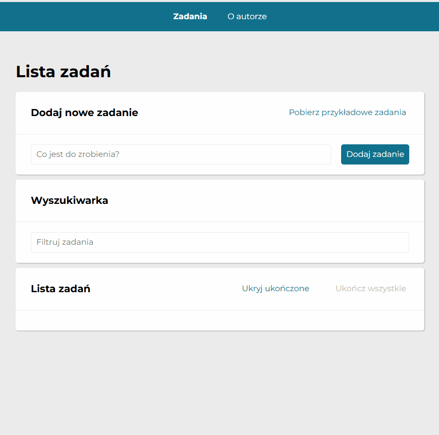

# Tasks-List

## Short description of app

Any tasks to do but you do not have any ideas how to manage them? Perhaps this simply tasks-list application will be helpful for you 😎

Remark: Previous application has been updated (refactoring of app) according to React features/concept. 
## Manual instruction

Please follow to below instruction:

Write your task in the label and click the button “Dodaj zadanie” or just simply press enter.
Your task will be added to the below list. Of course you can add as many tasks as you want.

You can manage your tasks after added them to the list just click on the green button when your task is finished or click on the red button when you decided to remove any task.

You can use two buttons on the right section: The 1st one hides or shows finished tasks and the 2nd one marks all finished tasks. Please notice if tasks list will be empty all buttons will be invisible. The 2nd button will be disabled when all tasks will be marked as finished.

## Application under the following link:

https://kantares77.github.io/tasks-list-immutability/

## Technologies

- HTML

- CSS

- BEM

- Grid

- Flex

- JavaScript

- React
